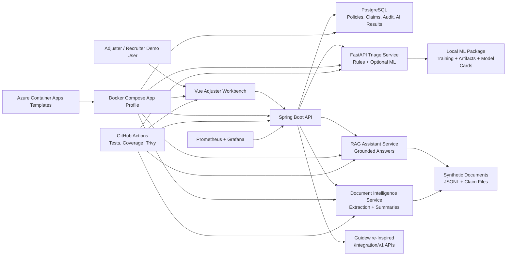

# InsureFlow AI

InsureFlow AI is a Guidewire-inspired claims and policy intelligence platform built as a professional insurance technology portfolio project.

It combines Spring Boot insurance workflows, Python AI services, local ML model training, document intelligence, RAG, Vue adjuster tooling, integration APIs, governance, observability, and cloud deployment readiness.

## What This Is

InsureFlow AI simulates how a modern P&C insurer can handle policy validation, FNOL intake, claim lifecycle operations, AI-assisted triage, document intelligence, adjuster assistance, human review, audit, and integration workflows.

It is designed for portfolio review, technical interviews, and insurance technology discussion. It uses synthetic data and local demo services so the system can be inspected without private insurance data.

## Important Boundary

This is not an official Guidewire product, connector, implementation, certification, or integration. It is a Guidewire-inspired portfolio project that demonstrates relevant insurance workflows and engineering patterns with synthetic data.

## Why It Matters

Claim operations are document-heavy, time-sensitive, and audit-sensitive. Insurers need reliable core workflows, explainable decision support, human-in-the-loop controls, integration boundaries, and operational visibility.

InsureFlow AI shows those concerns end to end in one project:

- policy and coverage validation before claim routing;
- claim intake, timeline, notes, documents, reserves, and status changes;
- AI triage with rule-based and ML-backed severity and fraud-risk signals;
- LLM-style document extraction and summarization with deterministic local providers;
- RAG-based adjuster assistance with grounded source references;
- human review, override, audit logging, governance views, and correlation IDs;
- CI, coverage, security scanning, Docker Compose, Azure templates, Prometheus, and Grafana.

## What It Demonstrates

- Insurance domain modeling for customers, policies, coverages, claims, documents, notes, reserves, and audit events.
- Java 21 and Spring Boot API engineering with PostgreSQL, Flyway, JPA, validation, security, and integration tests.
- Python FastAPI AI services with typed request/response contracts and deterministic tests.
- Local ML training with model cards, artifact metadata, and service fallback behavior.
- Vue 3 adjuster workbench that presents a full claim intelligence workflow.
- Guidewire-style integration API thinking without claiming official product compatibility.
- Responsible AI boundaries for decision-support systems.
- Cloud-native packaging and quality gates suitable for a public portfolio repository.

## Architecture



## Five-Minute Demo

Start with the guided script:

- [Five-minute demo script](docs/demo/demo-script.md)
- [Recruiter walkthrough](docs/demo/recruiter-walkthrough.md)
- [Interview talking points](docs/demo/interview-talking-points.md)
- [Screenshot checklist](docs/demo/screenshot-checklist.md)

Fast local demo path:

```bash
docker compose --profile app up --build
./scripts/smoke-test-containers.sh
```

Pre-demo readiness check:

```bash
./scripts/demo-readiness-check.sh
```

Frontend workbench:

```bash
cd frontend
npm install
npm run dev
```

Quality and observability path:

```bash
./scripts/run-tests.sh
./scripts/run-coverage.sh
./scripts/run-quality-gates.sh
docker compose --profile app --profile observability up -d --build
```

Grafana runs at `http://localhost:3000` when the observability profile is active. Swagger UI is available at `http://localhost:8080/swagger-ui.html` when the API is running.

## System Capabilities

| Area | What Exists |
| --- | --- |
| Domain foundation | PostgreSQL/Flyway schema for customers, policies, coverages, claims, documents, notes, reserves, audit, AI results, and integration events |
| Policy and claims workflow | Policy lookup, coverage validation, FNOL, claim timeline, notes, documents, status transitions, and claim operations |
| AI triage | Rule-based triage plus optional ML severity and fraud-risk model artifacts |
| ML training | Synthetic-data training pipeline, metrics, model cards, artifact loader, and reproducible tests |
| Document intelligence | Deterministic local LLM-style extraction, missing-document checks, summaries, retries, and audit |
| RAG assistant | Ingestion, chunking, retrieval, grounded answers, source references, and missing-evidence behavior |
| Frontend | Vue adjuster workbench for queue, claim detail, AI insight, documents, RAG, timeline, audit, and human review |
| Integration APIs | Guidewire-inspired policy sync, claim create, claim lookup, claim status, reserves, events, and webhook simulation |
| Governance | JWT roles, correlation IDs, audit logging, model/prompt registry views, AI evidence dashboard, and human review override enforcement |
| Deployment | Dockerfiles, Compose app profile, smoke tests, Azure Container Apps Bicep templates |
| Quality | Backend/Python/frontend tests, coverage reports, quality gates, Trivy security scan, Prometheus, Grafana, and load smoke script |
| Demo readiness | Settings readiness panel, demo script, screenshot checklist, recruiter walkthrough, and `scripts/demo-readiness-check.sh` |

## Tech Stack

- Java 21, Spring Boot 3.5, Maven, Spring Security, JPA, Flyway
- PostgreSQL, Docker Compose, Testcontainers
- Python, FastAPI, Pydantic, pytest, scikit-learn, pandas
- Vue 3, Vite, TypeScript, Vitest
- GitHub Actions, Trivy, JaCoCo, coverage.py, npm audit
- Prometheus, Grafana
- Azure Container Apps Bicep templates

## Local Run Commands

Backend:

```bash
cd backend
mvn test
```

All tests:

```bash
./scripts/run-tests.sh
```

Synthetic data:

```bash
cd synthetic-data-generator
python3 -m venv ../.venv
../.venv/bin/python -m pip install ".[dev]"
../.venv/bin/python -m pytest
../.venv/bin/python -m generator --customers 500 --policies 650 --claims 200 --adjusters 25 --seed 42 --output-dir ../data/synthetic
```

AI triage service:

```bash
cd ai-services/triage-service
python3 -m pip install -e ".[test]"
python3 -m pytest
python3 -m uvicorn triage_service.app:app --reload --port 8001
```

ML training:

```bash
cd ml
python3 -m pip install -e ".[test]"
python3 -m pytest
python3 -m insureflow_ml.train --data-dir ../data/synthetic --artifacts-dir artifacts
```

Document intelligence service:

```bash
cd ai-services/document-intelligence-service
python3 -m pip install -e ".[test]"
python3 -m pytest
python3 -m uvicorn document_intelligence.app:app --reload --port 8002
```

RAG assistant service:

```bash
cd ai-services/rag-service
python3 -m pip install -e ".[test]"
python3 -m pytest
python3 -m uvicorn rag_service.app:app --reload --port 8003
```

Frontend:

```bash
cd frontend
npm install
npm test -- --run
npm run build
npm run dev
```

## Documentation Map

Evaluator quick path:

- [Demo script](docs/demo/demo-script.md)
- [Recruiter walkthrough](docs/demo/recruiter-walkthrough.md)
- [Project narrative](docs/portfolio/project-narrative.md)
- [Resume bullets](docs/portfolio/resume-bullets.md)
- [Responsible AI statement](docs/ai/responsible-ai-statement.md)
- [Documentation index](docs/README.md)

Deep technical docs:

- [System context](docs/architecture/system-context.md)
- [Service architecture](docs/architecture/service-architecture.md)
- [Policy claims workflow API](docs/api/policy-claims-workflow.md)
- [AI triage API](docs/api/ai-triage.md)
- [Document intelligence API](docs/api/document-intelligence.md)
- [RAG assistant API](docs/api/rag-assistant.md)
- [Integration APIs](docs/api/integration-apis.md)
- [Security, audit, and governance](docs/api/security-audit-governance.md)
- [Cloud deployment](docs/deployment/cloud-deployment.md)
- [Testing, quality, and observability](docs/quality/testing-quality-observability.md)
- [Model training](docs/ml/model-training.md)
- [Severity model card](docs/ml/severity-model-card.md)
- [Fraud-risk model card](docs/ml/fraud-risk-model-card.md)

Project management:

- [Project memory](PROJECT_MEMORY.md)
- [Master build plan](docs/superpowers/plans/2026-06-24-insureflow-ai-master-build-plan.md)
- [Full project blueprint](PROJECT_BLUEPRINT.md)

## Responsible AI And Project Boundary

AI outputs in this project are decision-support signals only. They must not be used for real claim approval, denial, fraud accusation, legal advice, medical advice, or production insurance decisions.

The project uses synthetic data, deterministic local AI providers, local ML artifacts, explainable rule baselines, audit trails, human review controls, and model/prompt registry documentation to demonstrate responsible AI design patterns. See [docs/ai/responsible-ai-statement.md](docs/ai/responsible-ai-statement.md).
